# DigitalOcean Kubernetes Deployment

[Watch the video test-server demo](https://github.com/MP-30/hyper-scale-ops/releases/download/test-demo/test_server_demo.mkv)

<video src="https://github.com/MP-30/hyper-scale-ops/releases/download/test-demo/test_server_demo.mkv" controls width="100%"></video>

## Kubernetes Cluster

---

## Worker Nodes

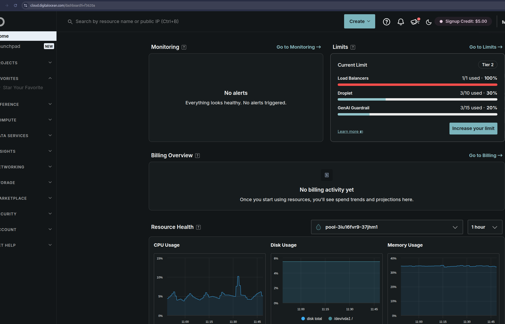
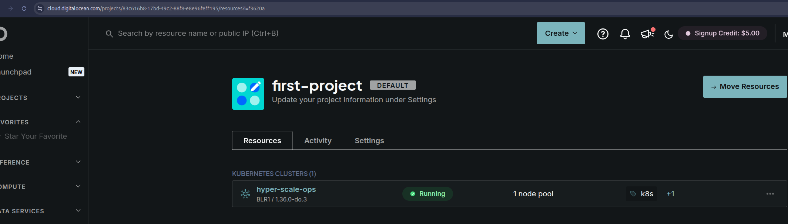
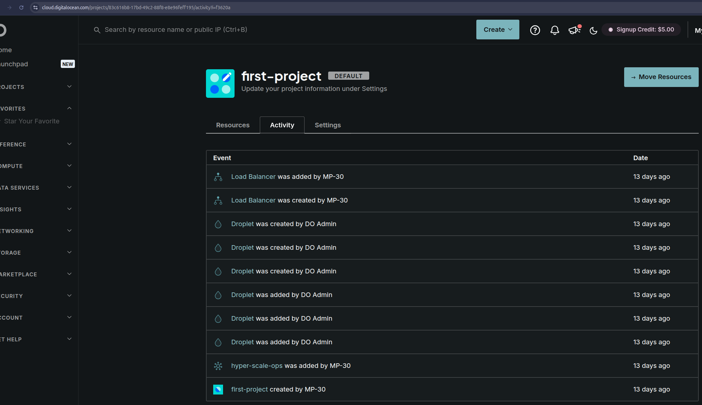
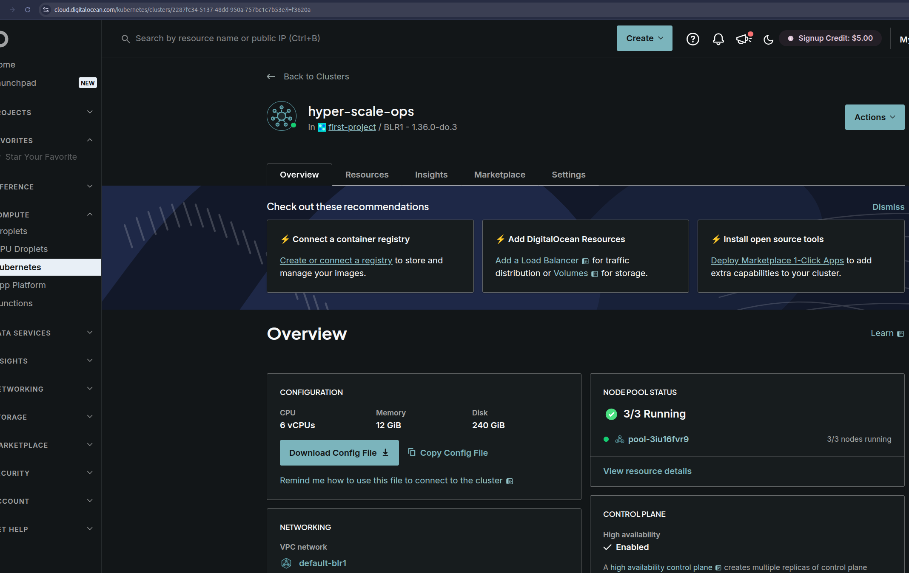
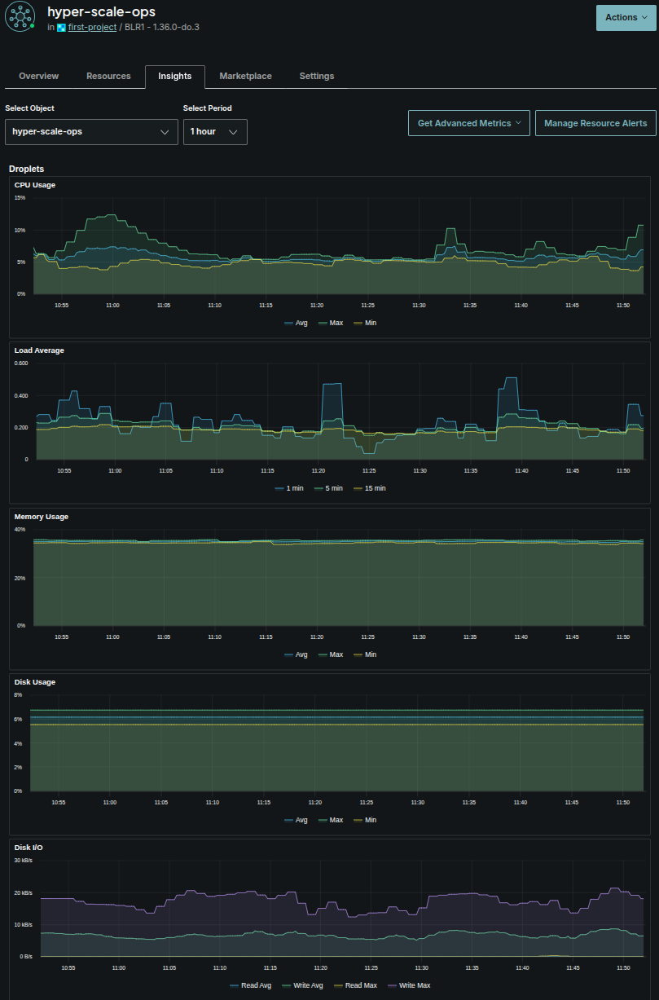
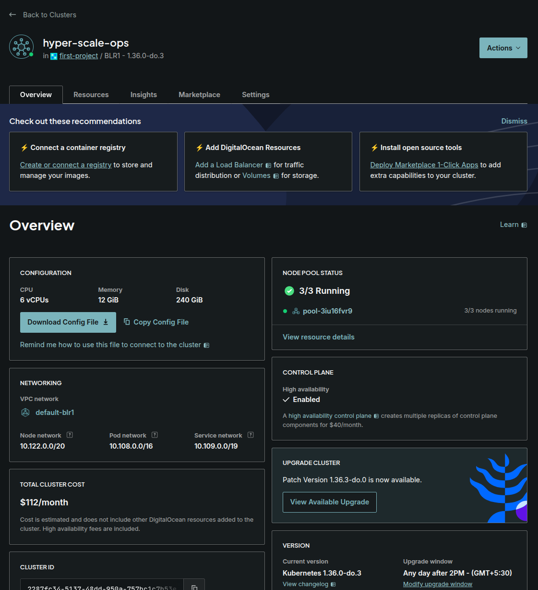
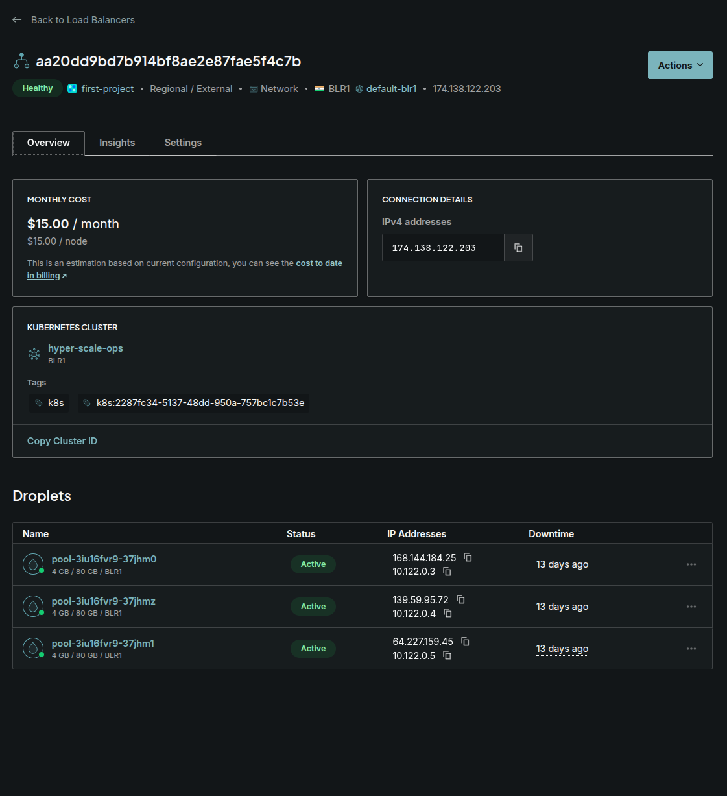
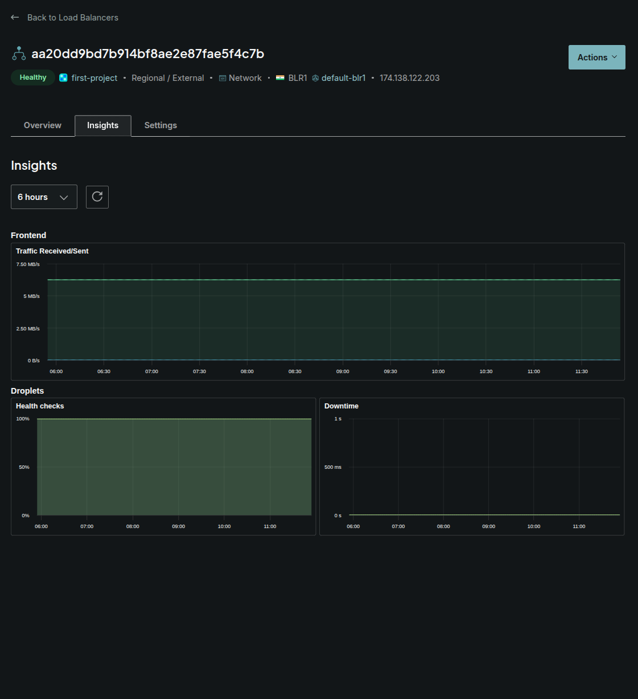
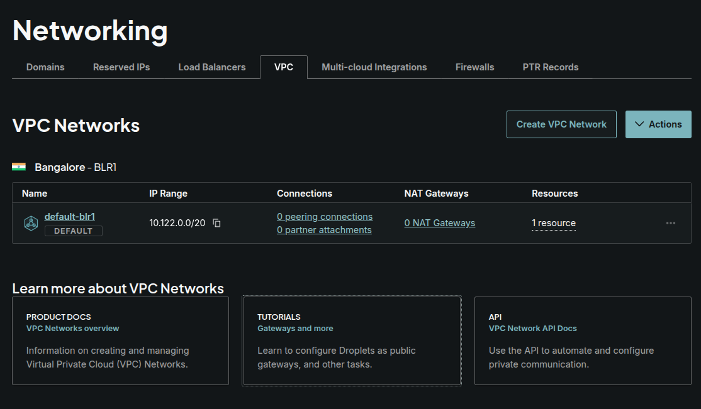
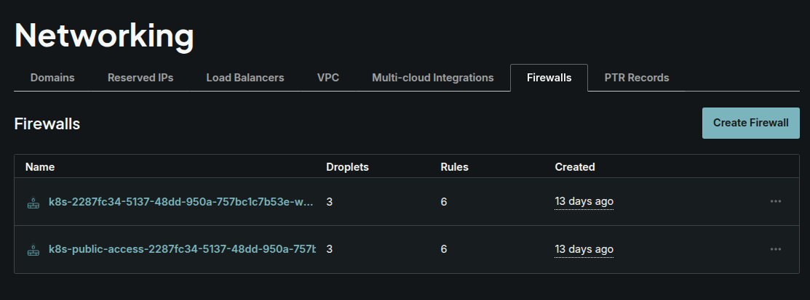
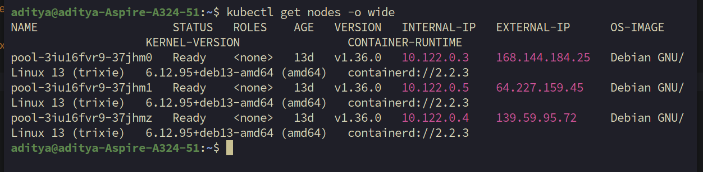
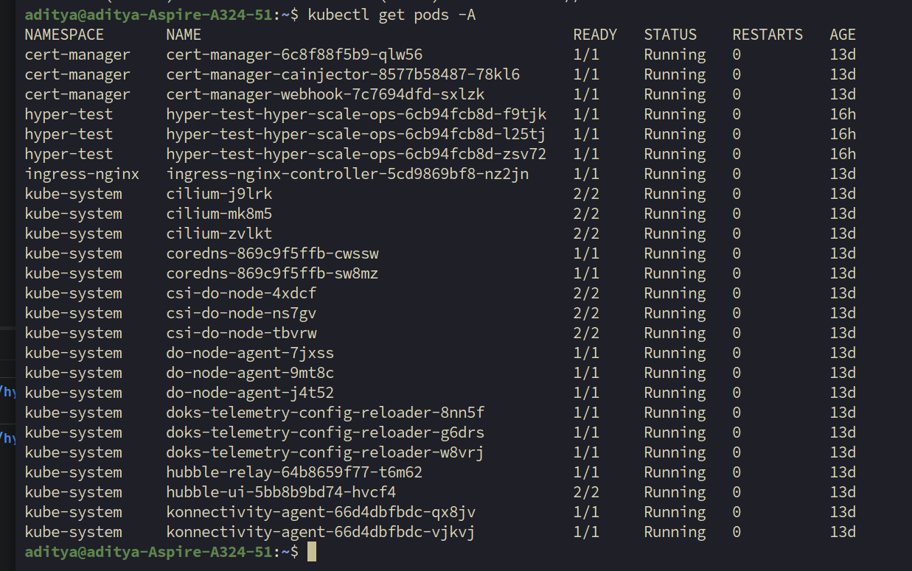
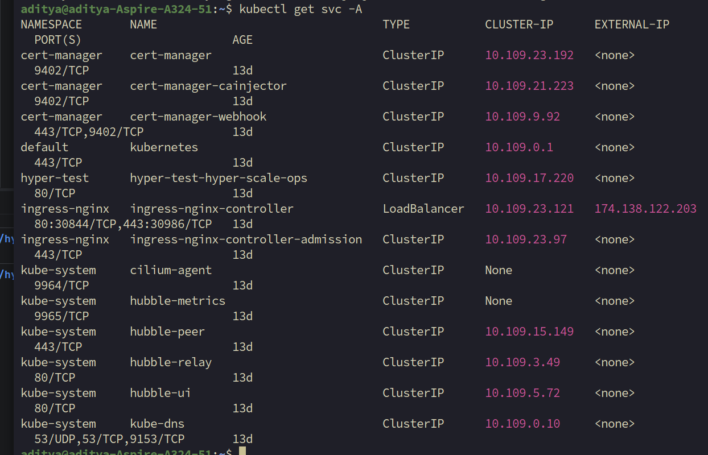
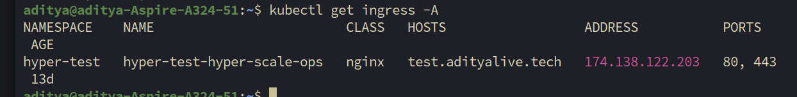
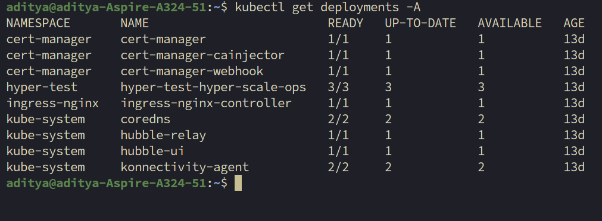
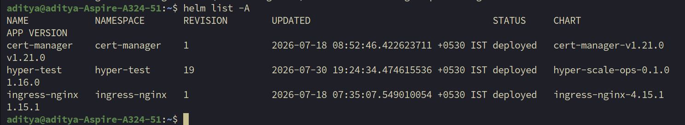
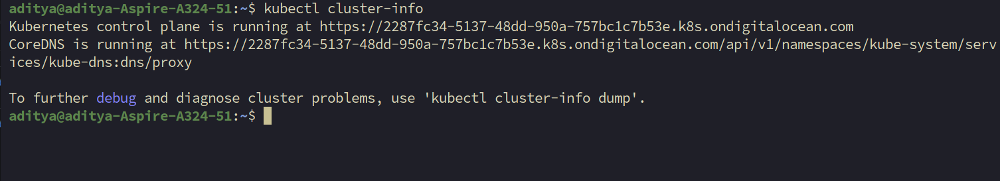
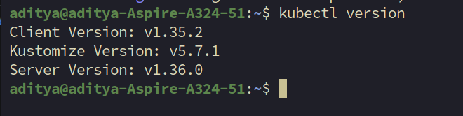
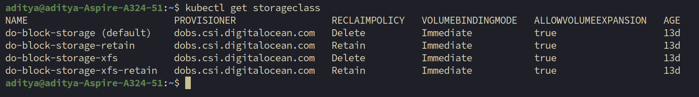
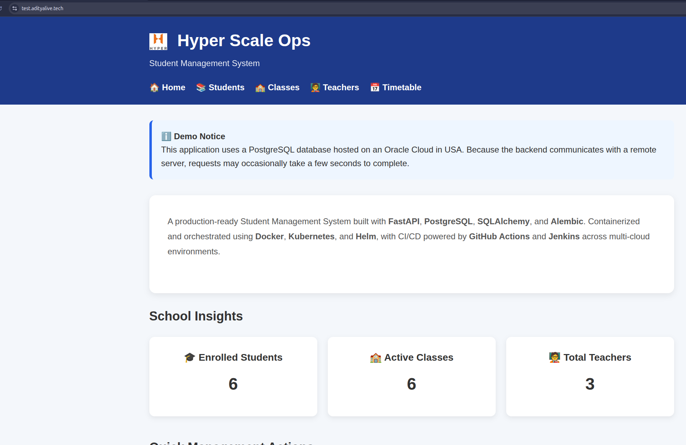

[//]: # (![Worker Nodes]&#40;images/do-nodes.png&#41;)

[//]: # ()
[//]: # (---)

[//]: # ()
[//]: # (## Running Pods)

[//]: # ()
[//]: # (![Running Pods]&#40;images/kubectl-pods.png&#41;)

[//]: # ()
[//]: # (---)

[//]: # ()
[//]: # (## Live Application)

[//]: # ()
[//]: # (![Application]&#40;images/app-home.png&#41;)

[//]: # ()
[//]: # (---)

[//]: # ()
[//]: # (## Datadog Dashboard)

[//]: # ()
[//]: # (![Datadog Dashboard]&#40;images/datadog-dashboard.png&#41;)